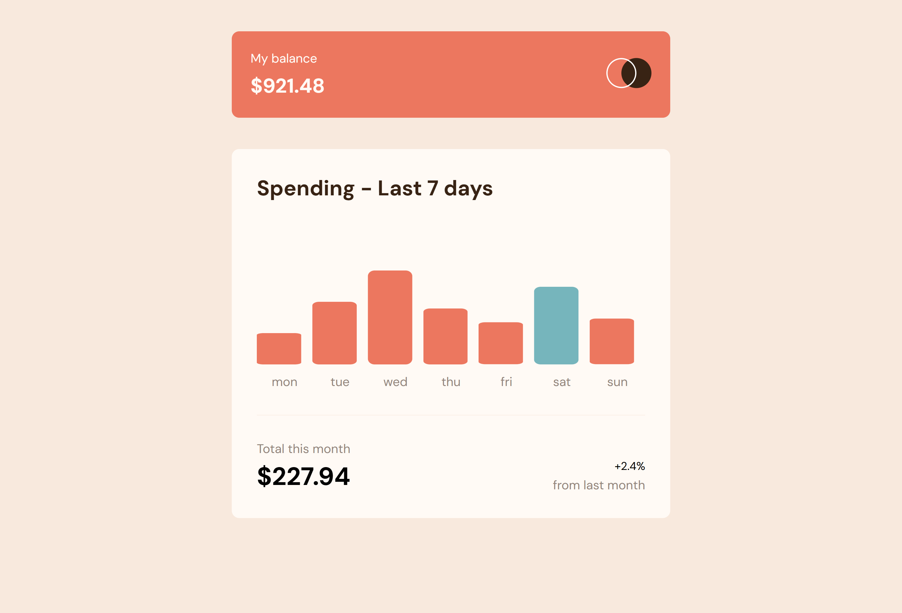

# Frontend Mentor - Expenses chart component solution

This is a solution to the [Expenses chart component challenge on Frontend Mentor](https://www.frontendmentor.io/challenges/expenses-chart-component-e7yJBUdjwt). Frontend Mentor challenges help you improve your coding skills by building realistic projects.

## Table of contents

- [Overview](#overview)
  - [The challenge](#the-challenge)
  - [Screenshot](#screenshot)
  - [Links](#links)
- [My process](#my-process)
  - [Built with](#built-with)
  - [What I learned](#what-i-learned)
  - [Continued development](#continued-development)
  - [Useful resources](#useful-resources)
- [Author](#author)

## Overview

### The challenge

Users should be able to:

- View a bar chart of their spending over the last 7 days
- See the current day highlighted in a different color
- Hover over the bars to see the exact amount spent
- View the total spending this month and the comparison with last month
- See responsive layout and smooth hover interactions

### Screenshot

### Links

- Solution URL: [Solution](https://www.frontendmentor.io/solutions/responsive-react-chart-spendings-component-FtHs8kiwJ2)
- Live Site URL: [Live](https://chart-expenses-one.vercel.app/)

## My process

### Built with

- Semantic HTML5
- CSS Modules
- Flexbox
- [React](https://reactjs.org/)
- [Vite](https://vitejs.dev/)
- SVG rendering with `<rect>` and `viewBox`

### What I learned

During this project I:

- Practiced dynamic rendering of SVG elements based on JSON data
- Learned how to calculate proportional heights for bars using max value from dataset
- Created a responsive layout using CSS modules and Flexbox
- Implemented custom tooltips that dynamically show above bars on hover
- Worked with relative units and positioning in SVG and DOM
- Learned how to properly structure and fetch local JSON files in a Vite project

### Continued development

In the future, I plan to:

- Add animation when bars appear or grow on page load
- Improve accessibility with ARIA attributes and focus states
- Add a dark mode toggle
- Expand the dataset to allow users to switch between weeks or months

### Useful resources

- [SVG viewBox and coordinate system](https://developer.mozilla.org/en-US/docs/Web/SVG/Attribute/viewBox)
- [How to use public assets in Vite](https://vitejs.dev/guide/assets.html#the-public-directory)
- [CSS Modules](https://github.com/css-modules/css-modules)

## Author

- GitHub - [PavAndrei](https://github.com/PavAndrei/)
- Frontend Mentor - [@PavAndrei](https://www.frontendmentor.io/profile/PavAndrei)
